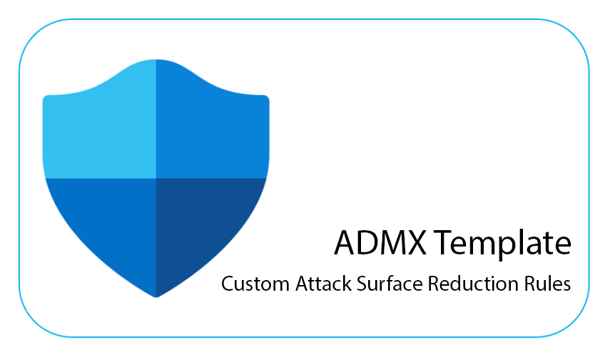

# Custom Attack Surface Reduction Rules ADMX Template

## Overview

This repository contains a custom ADMX template for configuring Attack Surface Reduction Rules in Windows environments. The template is designed to provide a structured and easily configurable approach to managing Attack Surface Reduction Rules using Group Policy.

## Table of Contents

- [Background](#background)
- [Features](#features)
- [Usage](#usage)
- [Installation](#installation)
- [Customization](#customization)
- [Contributing](#contributing)
- [License](#license)

## Background

Attack Surface Reduction (ASR) is a security feature in Windows Defender that helps prevent actions and scripts that can lead to malicious activities. This ADMX template simplifies the management of ASR rules through Group Policy, allowing administrators to easily configure and enforce security policies.

## Features

- Customizable ADMX template for Attack Surface Reduction Rules.
- Descriptive IDs for each rule, making it easy to understand the purpose of each configuration.
- Structured XML format compatible with the Group Policy Management Console.

## Usage

1. Download the ADMX and ADML files from the [Releases](https://github.com/ntelStream/ASR-ADMX/releases) page.
2. Place the ADMX file in the `C:\Windows\PolicyDefinitions` folder.
3. Place the ADML file in the `C:\Windows\PolicyDefinitions\en-US` folder (replace `en-US` with the appropriate language code for your environment).
4. Open the Group Policy Management Console on a domain controller.
5. Navigate to "Computer Configuration" > "Policies" > "Administrative Templates" > "Security Options."
6. Find the "Attack Surface Reduction Rules" policy and configure the desired rules.

## Installation

You can install this ADMX template by following the [Usage](#usage) instructions. Make sure to adapt the language code in the file paths according to your environment.

## Customization

If you need to customize the template or add additional rules, you can modify the XML files using a text editor or an XML editor. Refer to the [Microsoft documentation](https://docs.microsoft.com/en-us/troubleshoot/windows-client/group-policy/create-and-manage-adm-admx-files) for detailed information on creating ADMX templates.

## Contributing

Contributions are welcome! If you have improvements or additional features to suggest, please open an issue or submit a pull request.

## License

This project is licensed under the [MIT License](LICENSE).

